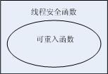

# 线程安全函数是什么

- 什么是线程安全?
一个函数被过个并发线程反复调用时,它会一直产生正确的,则该函数是线程安全函数.
那么什么又是可重载入函数?
当一个函数在被一个线程调用时,可以允许被其他线程再调用.即两个函数同时发生.则该函数是可重入函数.
所以显而易见,如果一个函数是可重入的,那么它肯定是线程安全的.但反之未然,一个函数是线程安全的,却未必是可重入的.比如我们在一个函数中调用到了一个全局变量NUM用来标记某一东西的数量.学过操作系统的同学都知道,如果我们在修改它的值的时候发生了中断,另一个函数又对他进行了修改,此时改变量的值会出错.这种函数就是线程不安全的函数.他是属于没有保护共享变量的线程不安全函数.在单线程时运行毫无问题,但是一旦放到多线程中就容易出bug.但如果我们在修改这个全局变量NUM前对他进行加锁,再操作完进行解锁.这样即使有两个线程在调用这个函数,其结果也不会出现问题.此时,这个函数就是线程安全函数.但它依旧不是可重载入函数.因为它不能保证两个函数同时运行,必须等待解锁后才能运行.而我们在平时开发中应该尽量编写可重载入的函数.如下图:

      
      
  线程不安全函数主要分为以下四大类:
  
  第一类: 不保护共享变量的函数
  
  a.函数中访问全局变量和堆
  共享变量在多鲜橙中是共享数据比如全局变量和堆,如果不保护共享变量,多线程就会出bug
  
  可以通过同步机制来保护共享数据,比如加锁.
  
  第二类: 函数中分配,重新分配释放全局资源
  
  与上面第一点基本相同,通过加锁可解决
  
  第三类: 返回指向静态变量的指针的函数,函数中通过句炳和指针的不直接访问
  
  比如: 我们尧计算a,b两个变量发的和,于是将a,b的指针传入某一个函数,然而此时可能有另一个线程改变了a,b的值,此时在函数中我们通过地址获取到的两个数的值已经改变了,所以计算出的结果也就是错的了.
  
  又比如某些函数(如gethostbyname)将计算结果放在静态结构中,并返回一个指向这个结构的指针.在多线程中一个线程调用的结果可能个被另一个线程覆盖.可以通过重写函数和加锁拷贝技术来消除.加锁拷贝技术指在每个位置对互斥锁加锁.调用线程不安全函数,动态的为结果分配存储器,拷贝函数返回的结构,然后解锁.
  
  第四类:调用线程不安全函数
  常见的系统线程不安全函数
  
  
 
 
 
 目前上述大部分函数已经有了对应的线程安全版本的事项,例如:针对getpwnam的getpwnam_r(),(这里的_r(reentrant),如前所述,可重载入的函数都是线程安全的).在多鲜橙软件开发中,如果需要使用到上所述函数,应优先使用它们对应的线程安全版本.
 
 因此在编写线程安全函数时,要注意两点:
 
 1.减少对临界资源的依赖,尽量避免访问全局变量,静态变量或者其他共享资源,如果必须要使用共享资源,所有使用到的地方必须尧进行互斥所(Mutx)保护;
 2.线程安全的函数锁调用到的函数也应该是线程安全的,如果所调用的函数不是线程安全的,那么这些函数也必须被互斥锁保护.
 
 